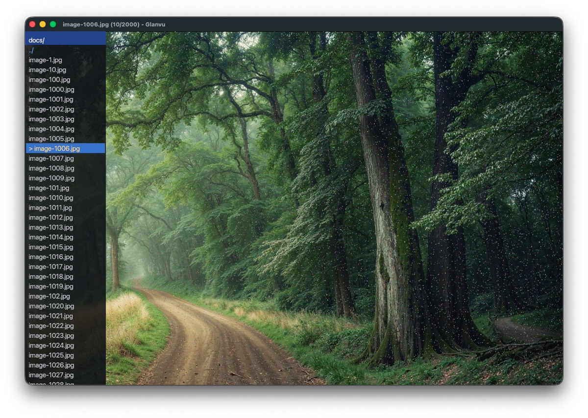
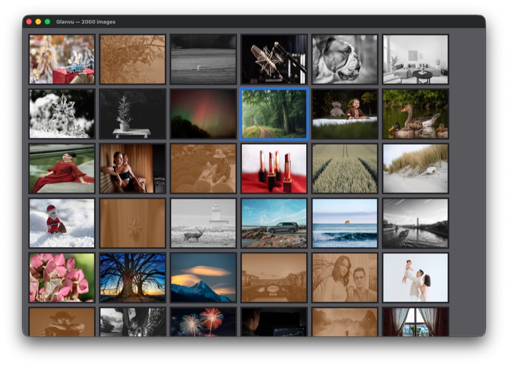
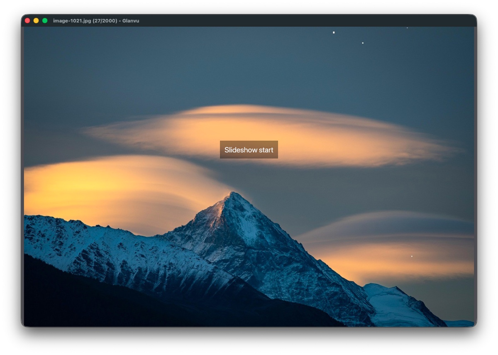
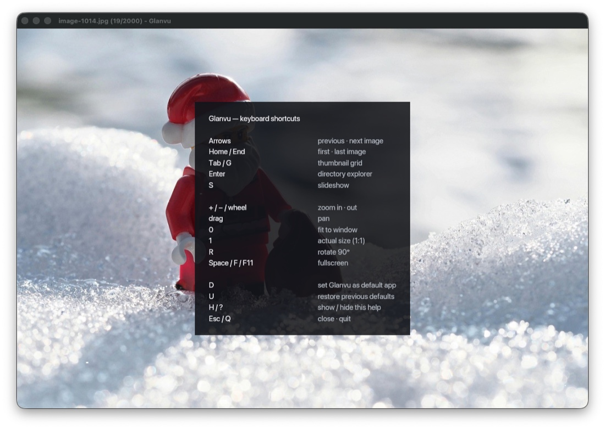

<div align="center">

# Glanvu

### The viewer that just opens.

A fast, keyboard-driven **image viewer and converter** for Linux, macOS and Windows.
GPU-accelerated, tiny footprint, no clutter — just your images, now.

**Free and open source.**


</div>

---

## Why Glanvu

Power users want one viewer that **loads instantly, navigates by keyboard, and batch-converts** —
without hunting for a dedicated app per format or waiting on a bloated editor to boot. On Linux and
macOS that combination has never really existed.

Glanvu is a clean-room tool built in that spirit: near-instant load, a GPU-accelerated render path,
agile keyboard shortcuts, a real batch-convert pipeline, and a format layer that keeps growing.

The name is **glance + view** — a fast look.

## What you get today

- **Instant image viewing** — JPEG, PNG, WebP, GIF, BMP and TIFF, decoded by pure-Rust codecs and
  drawn on the GPU (wgpu). No system C libraries, no surprises.
- **Keyboard-first navigation** — walk a whole folder with the arrow keys; zoom, pan, rotate, fit,
  and go fullscreen without touching the mouse. Press **H** any time for the full cheatsheet.
- **Thumbnail grid** — press **Tab** for a fast, scrollable overview of the folder.
- **Directory explorer** — press **Enter** to browse folders and jump between images.
- **Slideshow** — press **S** to start an auto-advancing slideshow.
- **Batch convert** — a real CLI pipeline: convert, resize, crop, rotate, re-quality and rename
  whole folders in parallel, with guards against overwriting or colliding output files.
- **Native macOS app** — a proper `.app` bundle with "Open With", drag-and-drop, and a file picker.
- **One-command default** — `glanvu set-default` makes Glanvu the default viewer for every image
  type at once; no per-type fiddling in Finder (macOS).
- **Cross-platform by design** — one Rust codebase targeting Linux, macOS and Windows.

<div align="center">

| Directory explorer (`Enter`) | Thumbnail grid (`Tab`) |
|:---:|:---:|
|  |  |

| Slideshow (`S`) | Keyboard help (`H` / `?`) |
|:---:|:---:|
|  |  |

</div>

## Install

Pre-built binaries for v0.5.3 are available at [glanvu.com](https://glanvu.com) and
[GitHub Releases](https://github.com/glanvu/glanvu/releases):

| Platform | Download |
|---|---|
| macOS (Apple Silicon) | [`Glanvu-0.5.3-macos-arm64.zip`](https://github.com/glanvu/glanvu/releases/download/v0.5.3/Glanvu-0.5.3-macos-arm64.zip) |
| Linux x86_64 | [`glanvu-0.5.3-linux-x86_64.tar.gz`](https://github.com/glanvu/glanvu/releases/download/v0.5.3/glanvu-0.5.3-linux-x86_64.tar.gz) · [`.deb`](https://github.com/glanvu/glanvu/releases/download/v0.5.3/glanvu_0.5.3_amd64.deb) |
| Windows x64 | [`Glanvu-0.5.3-windows-x86_64.zip`](https://github.com/glanvu/glanvu/releases/download/v0.5.3/Glanvu-0.5.3-windows-x86_64.zip) |

Package managers (Homebrew tap, Scoop bucket, AUR, winget, Chocolatey) are being published —
see the [Roadmap](#roadmap).

### Build from source

```bash
git clone https://github.com/glanvu/glanvu && cd glanvu
make release            # release binary → target/release/glanvu
make app                # macOS .app bundle → dist/macos/Glanvu.app  (macOS only)
make install-app        # install to /Applications/                  (macOS only)
```

## Usage

```bash
glanvu <IMAGE>                  # open the viewer (arrow keys walk the folder)
glanvu                          # open a file picker, then the viewer
glanvu info <IMAGE>             # print format, dimensions and size
glanvu convert --to webp --resize 2000x2000 --out out/ photos/*.jpg
glanvu set-default              # make Glanvu the default app for image files (macOS)
glanvu --help
```

### Batch conversion

`glanvu convert` decodes, transforms and re-encodes many files in parallel (headless, no GPU).
Globs are expanded by your shell, so inputs are just a list of paths. Transforms apply in a fixed
order: **crop → rotate → resize → encode**.

| Option | Argument | What it does |
|---|---|---|
| `-t, --to` | `FMT` | Target format: `jpg`, `png`, `gif`, `bmp`, `tiff`, `webp` (required) |
| `-c, --crop` | `X,Y,WxH` | Crop a region (pixels); validated against the image size |
| `--rotate` | `90` `180` `270` `-90` | Fixed-angle clockwise rotation (negatives = counter-clockwise) |
| `-r, --resize` | `WxH` | Fit within `WxH`, preserving aspect ratio |
| `-q, --quality` | `1-100` | JPEG quality (JPEG output only; ignored otherwise) |
| `--rename` | `PATTERN` | Output name: `{stem}`, `{n}`, `{n:04}` (1-based, zero-padded); extension added |
| `-o, --out` | `DIR` | Output directory (default: next to each input) |

```bash
# Re-quality PNGs to web-sized JPEGs
glanvu convert --to jpg --quality 85 --out web/ photos/*.png

# Crop a 512×512 detail, then rotate it 90°
glanvu convert --to png --crop 100,100,512x512 --rotate 90 shot.png

# Renumber a series: holiday_001.webp, holiday_002.webp, …
glanvu convert --to webp --rename "holiday_{n:03}" --out out/ *.jpg
```

Glanvu refuses to overwrite an input or to map two inputs to the same output (data-loss guards).

### Keyboard shortcuts

| Key | Action |
|---|---|
| `←` `→` | Previous · next image |
| `Home` / `End` | First · last image |
| `Tab` / `G` | Thumbnail grid |
| `Enter` | Directory explorer |
| `S` | Slideshow |
| `O` | Toggle sort order (name / date) |
| `+` / `−` / wheel | Zoom in · out |
| drag | Pan |
| `0` | Fit to window |
| `1` | Actual size (1:1) |
| `R` | Rotate 90° |
| `C` / `Shift+C` | Copy image · copy file path to clipboard |
| `Space` / `F` / `F11` | Fullscreen |
| `D` | Set Glanvu as default viewer (macOS) |
| `U` | Restore previous defaults (macOS) |
| `H` / `?` | Show / hide help |
| `Esc` / `Q` | Close · quit |

## Roadmap

Glanvu's north star is a **universal viewer**: open almost anything, instantly. The fast image
viewer above is the foundation. Planned, in priority order:

- **More formats** — RAW (photography), AVIF/HEVC, EXR and gigapixel images, multipage documents.
- **Technical & 3D** — DICOM (medical), CAD drawings, 3D-printing formats (STL/OBJ/3MF/STEP/G-code)
  and general 3D models.
- **Distribution** — Direct downloads available for macOS, Linux and Windows (v0.5.3).
  Package managers in progress: Homebrew tap, Scoop bucket, AUR, winget, Chocolatey.
  Code signing and auto-update planned.
- **Hosted (Phase 3)** — [glanvu.com](https://glanvu.com): web viewer, shareable links, and a
  browser-based batch-convert service (upload images, choose transforms, download results).

C-backed and untrusted codecs will be added behind process isolation (glycin-style sandboxing), not
linked into the main process.

## Architecture

Glanvu is a Cargo workspace with a strict boundary between image logic and the GPU/window layer, so
the core stays portable and unit-testable:

- **`glanvu-core`** — decode, normalize and convert. No GPU, no window; fully testable.
- **`glanvu-viewer-core`** — pure viewer state (folder navigation, thumbnails, grid, explorer).
  No GPU, no window; depends only on `glanvu-core`.
- **`glanvu`** — the viewer (winit + wgpu, glyphon text overlay) and the batch-convert CLI.

See [`AGENTS.md`](AGENTS.md) for the full contributor guide.

## Building & testing

```bash
cargo test
cargo clippy --all-targets -- -D warnings
cargo fmt --all --check
```

The workspace enforces `unsafe_code = deny` and `clippy::all = warn`.

## License

[Apache-2.0](LICENSE).
